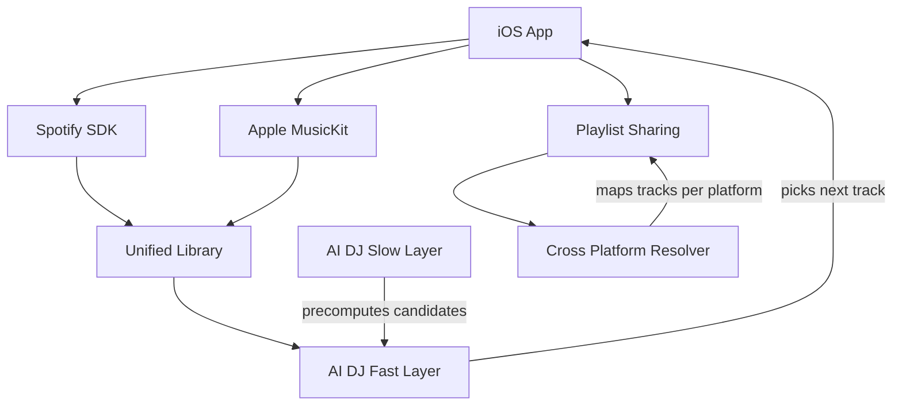

# Blueprint: savvautops/opendecks

_Auto-generated architectural documentation — 2026-09-24 (Phase 1). Built from the repository file tree, README and manifests._

## Diagram

## How it works

OpenDecks is a product-brief-stage iOS app concept: a music-agnostic player that unifies the subscriptions you already pay for, shares playlists across platforms, and replaces dumb shuffle with a local AI DJ.

The architecture has three pillars. **Playback** is bring-your-own-subscription — Spotify via its iOS SDK and Apple Music via MusicKit; the app never touches audio files or licenses. **The DJ** is a two-layer on-device intelligence system: a fast System-1 decision model picks the next track in milliseconds from energy, tempo, key, and user steering, while a slower System-2 layer builds taste profiles and precomputes candidate pools during idle time. **Sharing** serializes playlists as ISRC fingerprints and resolves them per-platform at open time, honestly reporting match rates.

The economic insight driving the design: because all inference runs on-device, there are no server bills — which is what makes a one-time purchase price sustainable where every competitor needs a subscription. The repo currently holds only the brief (`brief.md`, `README.md`); no code exists yet.

## Key files

- `brief.md` — the full product brief: problem, solution, architecture, business model
- `README.md` — one-liner pitch and concept summary

## For the owner

OpenDecks is your parked music-app idea, captured as a thorough product brief before any code exists. The core bet: a DJ that lives on your phone, reads the room, and works with the Spotify and Apple Music accounts you already pay for — sold once, not rented monthly, because on-device AI means no server costs. If you ever pick this back up, the brief is the blueprint the build starts from.
